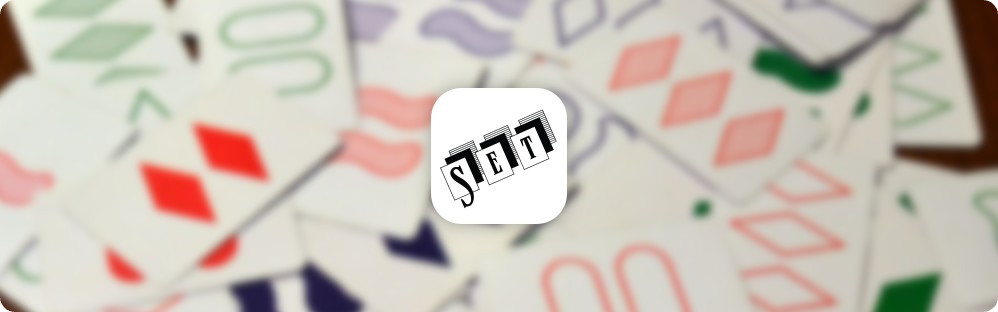
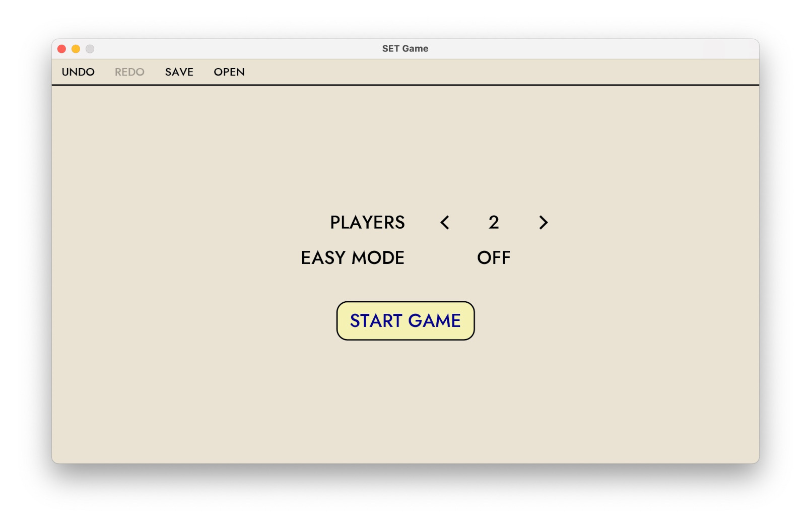
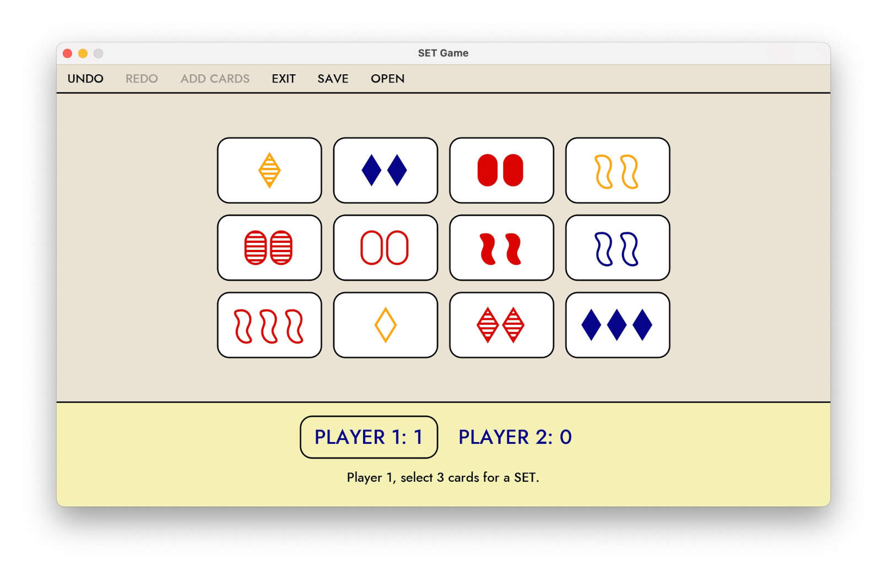
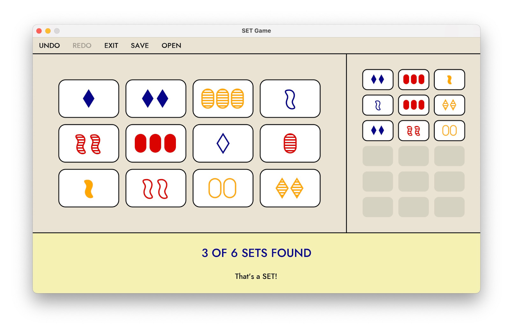
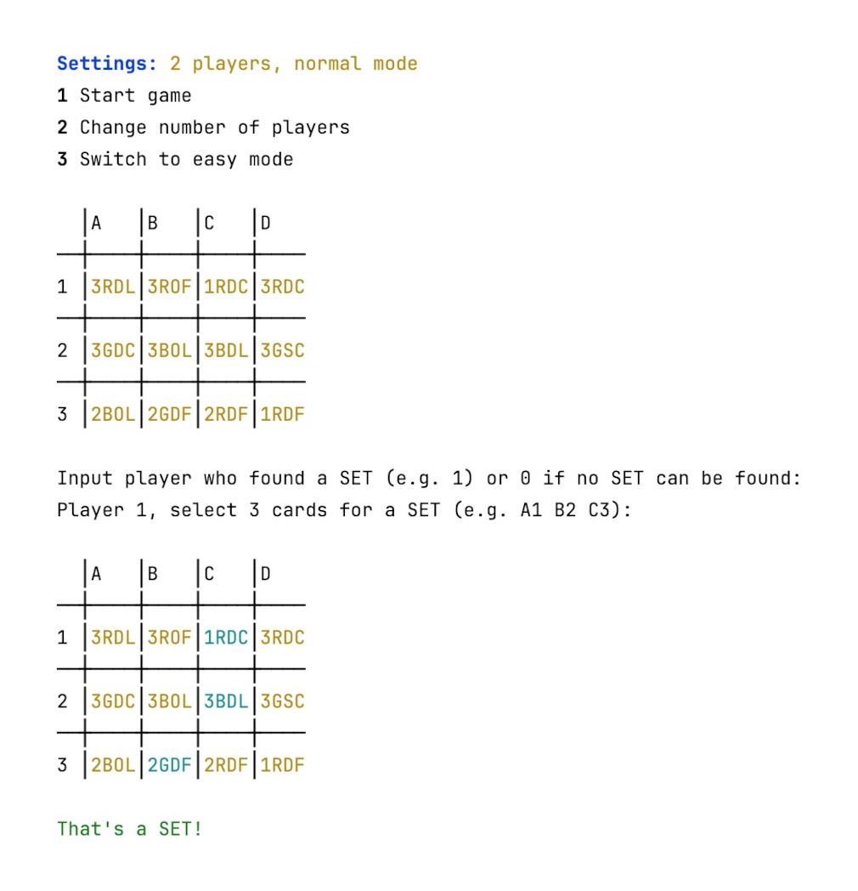

# SET Game

[](https://www.gnu.org/licenses/gpl.txt) [](https://github.com/patzly/set-game-scala/actions/workflows/scala.yml) [](https://coveralls.io/github/patzly/set-game-scala?branch=main)

This is an unofficial Scala version of the SET game for Software Engineering classes at HTWG Konstanz.

The object of the game is to identify a 'SET' of three cards from 12 cards placed face up on the table. Each card has four features:

* **Number:** 1, 2, 3
* **Symbol:** oval, squiggle, diamond
* **Shading:** solid, striped, outlined
* **Color:** red, green, purple

A SET contains of three cards in which each of the cards' features, looked at one-by-one, are the same on each card, or, are different on each card.
If two cards are the same and one card is different in any feature, then it is not a SET. A SET must be either all the same or all different in each individual feature.

In easy mode, the game starts with 9 cards instead of 12 and without the shading feature. This makes it easier to find a SET.

## Features

* Singleplayer/Multiplayer mode
* "Easy start" mode
* Interactive GUI, game state representation as text-based UI

## Screenshots

<a href="https://raw.githubusercontent.com/patzly/set-game-scala/main/assets/screen_1.png"></a>
<a href="https://raw.githubusercontent.com/patzly/set-game-scala/main/assets/screen_2.png"></a>
<a href="https://raw.githubusercontent.com/patzly/set-game-scala/main/assets/screen_3.png"></a>  
<a href="https://raw.githubusercontent.com/patzly/set-game-scala/main/assets/screen_4.png"></a>

## Docker

You can run SET in a Docker container. To do so, you need to have Docker installed on your machine.  
First build the Docker image by running the following command in the root directory of the project:

```bash
docker build -t set-game-scala .
```

Then you can run the game by executing the following command:

```bash
docker run -it set-game-scala
```

On Linux, you can execute the following commands instead to run the game with enabled GUI:

```bash
sudo sxhost +local:docker
sudo docker run -it -e HEADLESS=false -e DISPLAY=$DISPLAY -v /tmp/.X11-unix:/tmp/.X11-unix set-game-scala
```

## License

Copyright &copy; 2023-2024 Matthias Elbel & Patrick Zedler. All rights reserved.

[GNU General Public License version 3](https://www.gnu.org/licenses/gpl.txt)

> SET Game is free software: you can redistribute it and/or modify it under the terms of the GNU General Public License as published by the Free Software Foundation, either version 3 of the License, or (at your option) any later version.
>
> SET Game is distributed in the hope that it will be useful, but WITHOUT ANY WARRANTY; without even the implied warranty of MERCHANTABILITY or FITNESS FOR A PARTICULAR PURPOSE. See the GNU General Public License for more details.
